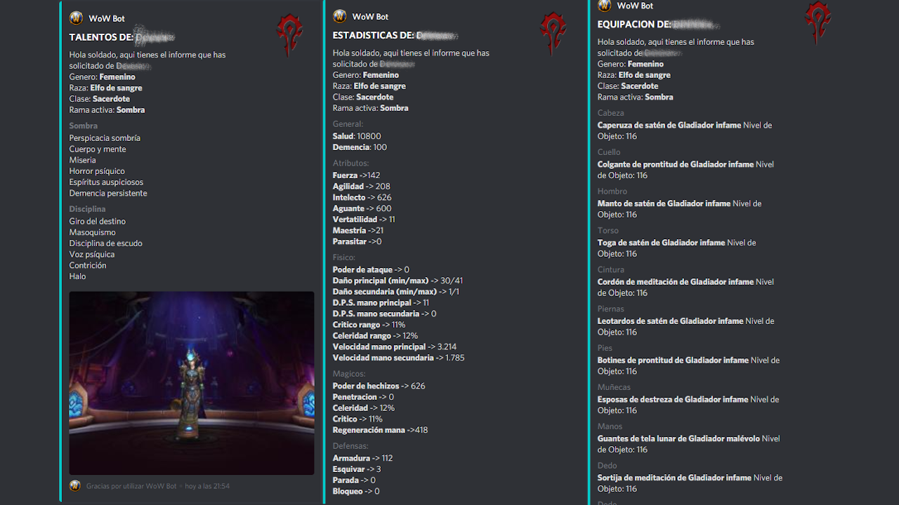
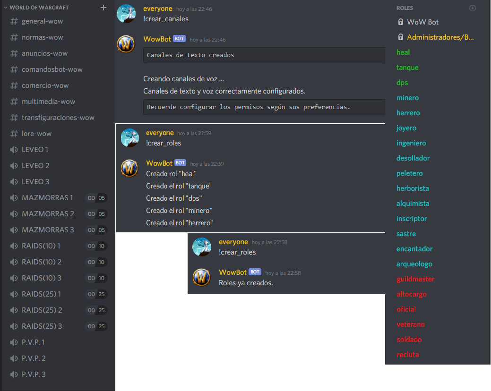
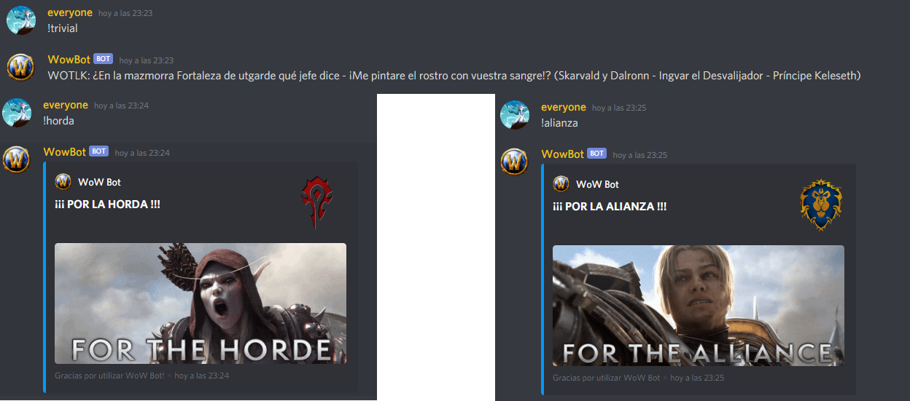

# World of Warcraft Discord Bot
## Bot para Discord orientado al juego de Blizzard World of Warcraft.

#### DATOS DE BLIZZARD API DE PERSONAJES
Este bot, orientado para guilds de World of Warcraft, une la api de Blizzard con Discord, si lo deseas puedes recibir los datos de cualquier personaje de cualquiera de los reinos de EU, ya sean estadísticas generales, equipación o talentos, entre otras muchas cosas.

#### ESTRUCTURA AUTOMÁTICA DE ROLES Y CANALES
También podrás crear automáticamente una estructura básica de canales de voz y texto, así como una estructura de roles de Discord que incluyen posiciones (dps,heal.tanque), profesiones (minero,herrero,alquimista,...) y rangos para la guild (recluta,soldado,veterano,...).

#### CREACIÓN DE EVENTOS PROGRAMADOS
World of Warcraft Discord Bot está preparado para que puedas crear eventos programados para una fecha y hora determinada y los miembros puedan apuntarse a él. También puedes crear una raid (de 5, 10 o 25 jugadores) rápida (puedes progrmarla para un mínimo de 1 minuto y hasta un máximo de 90) en la que los miembros pueden apuntarse.

#### DIVIÉRTETE CON TUS COMPAÑEROS DE ARMAS
Este bot incluye divertidos comandos con los que pasar el rato y hacer piña con el resto de miembros de la guild como por ejemplo, un trivial de temática WoW, un juego de dados, divertidos gifs de world of Warcraft y algunos comandos de sonido, entre otros.

#### COMANDOS ADMINISTRACIÓN 
-> !crear_canales :: Crea una estructura de canales básica para W.o.W .

-> !limpiar + arg :: borra el número de mensajes de arg (desde 1 a 100).

-> !poner_rol + arg :: Pone a un miembro un rol.

-> !quitar_rol + arg :: quita a un miembro un rol.

-> !crear_roles :: Crea una estructura de roles (rol, profesiones, rangos).

-> !cambiar_nick + arg :: cambia el apodo de un miembro.

#### COMANDOS DE EVENTOS 
-> !crear_evento + arg :: Crea un nuevo evento.

-> !borrar_evento + arg :: Borra el evento por id y lista de nuevo los eventos activos.

-> !apuntarse + arg :: apunta a un pj si cumple requisitos de GearScore.

-> !ver_evento + arg :: lista los datos del evento y los personajes apuntados en cada rol.

-> !lista_eventos :: lista los eventos guardados.

#### COMANDOS DE SONIDOS 
-> !join :: Me uno a tu canal de voz.

-> !leave :: Dejo el canal de voz.

-> !preparados :: No estáis preparados.

-> !murloc :: A saber lo que dice.

-> !chistes :: Todos los chistes de las razas Alis, hasta Pandarian.

#### COMANDOS WORLD OF WARCRAFT 
-> !stats + arg :: Muestra las estadísticas de un jugador en un reino.

-> !equipo + arg :: Muestra la equipación de un jugador en un reino.

-> !talentos + arg :: Muestra los talentos de un jugador en un reino.

-> !talentos_lite + arg :: lo mismo que talentos pero sin la descripción de cada talento.

-> !item + arg :: Muestra datos de items.

-> !misiones_en :: Muestra el listado de misiones de una zona.

-> !mision + arg :: Muestra los datos de la misión de la que le proporcionemos el ID.

-> !bicho + arg :: Muestra los datos de una criatura de la que le proporcionemos el ID.

-> !montar_raid :: Permite apuntarse para una RAID/MAZMORRA.

#### OTROS COMANDOS 
-> !trivial :: juego de preguntas y respuestas con temática WoW.

-> !alianza :: ¡ÁNIMO SOLDADOS DE LA ALIANZA! Que este gif os de la fuerza necesaria.

-> !horda :: ¡ÁNIMO SOLDADOS DE LA HORDA! Que este gif os de la fuerza necesaria.

-> !dame_gif :: Te muestra un gif relacionado con World of Warcraft.

-> !dados :: Realiza una tirada de dados entre 1 y 100.

-> !frase :: Te devuelve una frase de WoW al azar.
